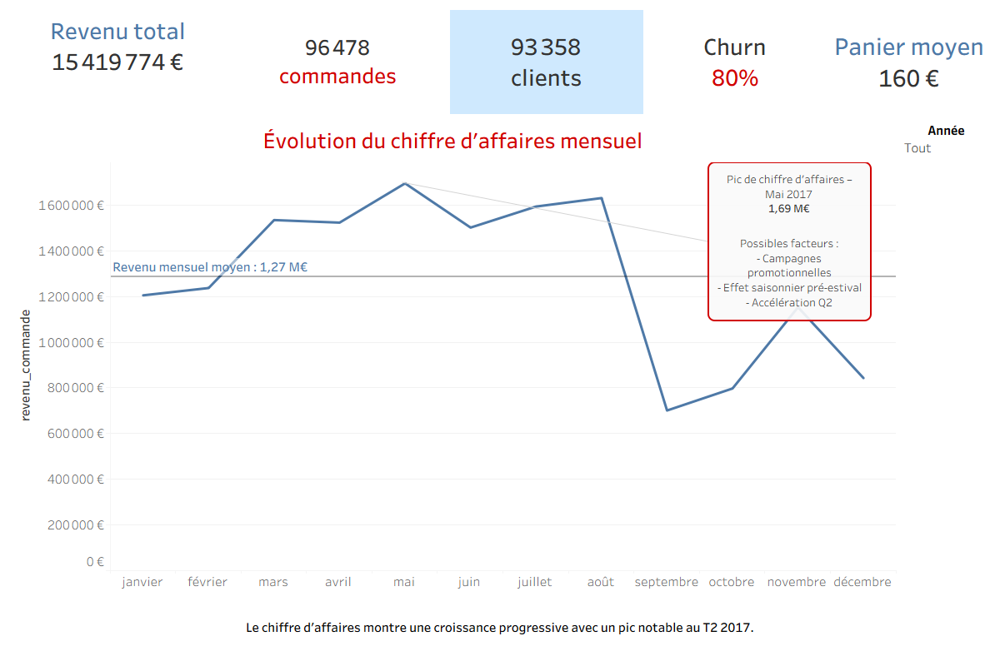

# Analyse du churn client et du chiffre d’affaires – Olist E-commerce

## Présentation du projet

Le churn client représente un enjeu majeur pour les entreprises e-commerce, car il impacte directement la croissance du chiffre d’affaires et la valeur vie client.

Ce projet vise à analyser le comportement d’achat des clients à partir du dataset **Olist E-commerce** afin de :

- mesurer le taux de churn
- identifier les facteurs expliquant l’inactivité des clients
- produire des insights business à travers des dashboards interactifs

L’analyse a été réalisée en utilisant :

- **SQL Server** pour la préparation et la transformation des données
- **Tableau** pour la visualisation et l’exploration des données

---

# Objectif métier

L’objectif de ce projet est de comprendre :

- pourquoi certains clients cessent d’acheter
- comment le churn impacte le chiffre d’affaires
- quels indicateurs permettent d’identifier les clients à risque

Dans cette analyse, un client est considéré comme **churn** lorsqu’il n’a effectué **aucun achat dans les 90 jours suivant sa dernière commande**.

---

# Workflow d’analyse des données

L’analyse a suivi un processus structuré en plusieurs étapes.

---

## 1. Préparation des données

Les données du dataset **Olist E-commerce** ont été importées dans **SQL Server**.

Les principales opérations de préparation incluent :

- correction des types de données
- création de **vues analytiques**
- agrégation des commandes
- construction des indicateurs clients

---

## 2. Feature Engineering

Plusieurs variables analytiques ont été créées afin d’analyser le comportement client :

- date du dernier achat client
- segmentation par récence d’achat
- indicateur de churn (inactivité de 90 jours)
- indicateurs de chiffre d’affaires

Ces variables permettent de mieux comprendre la relation entre **activité client et performance commerciale**.

---

## 3. Visualisation des données

Des dashboards ont été réalisés dans **Tableau** afin de présenter les principaux résultats de l’analyse.

Deux dashboards principaux ont été développés.

---

# Dashboard 1 — Executive Overview

Ce dashboard offre une **vue synthétique de la performance commerciale**.

Principaux indicateurs :

- chiffre d’affaires total
- nombre de commandes
- nombre de clients
- panier moyen
- évolution mensuelle du chiffre d’affaires

Ce dashboard permet d’obtenir rapidement une **vision globale de l’activité e-commerce**.

---

# Dashboard 2 — Analyse du churn client

Ce dashboard analyse les **facteurs expliquant le churn client**.

Principales analyses :

- taux de churn global
- répartition clients actifs vs churn
- distribution des clients selon la récence d’achat
- probabilité de churn selon la récence

Cette analyse permet d’identifier **les segments de clients les plus à risque**.

---

# Insights clés

Les résultats montrent que **la récence d’achat est le principal facteur explicatif du churn**.

L’analyse met en évidence que :

- une part importante de la base clients est inactive depuis plus de 6 mois
- les clients inactifs depuis plus de 6 mois présentent une probabilité de churn proche de **100 %**
- le taux global de churn atteint environ **80 %**

Ces résultats suggèrent que les entreprises doivent mettre en place des **actions CRM ciblées** pour réactiver les clients inactifs.

---

# Conclusion

Ce projet démontre comment l’analyse du comportement client peut fournir des insights utiles pour la stratégie business.

En se concentrant sur la **récence d’achat**, les entreprises peuvent :

- détecter plus tôt les clients à risque
- prioriser les actions de fidélisation
- réduire l’impact financier du churn

---

# Outils utilisés

- SQL Server
- Tableau
- Excel
- GitHub

---

# Dataset

Olist Brazilian E-commerce Dataset  
Source : Kaggle

---

# Dashboards

Executive Overview  

Customer Churn Analysis
